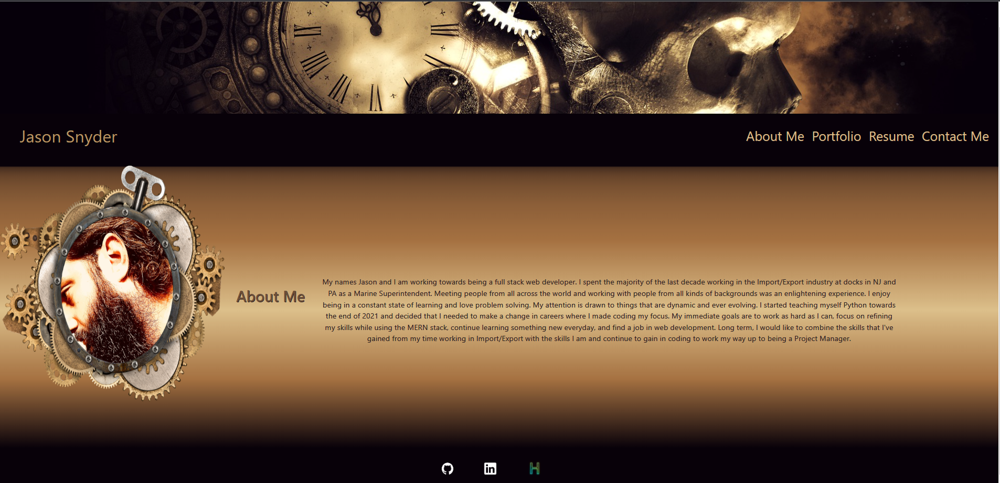
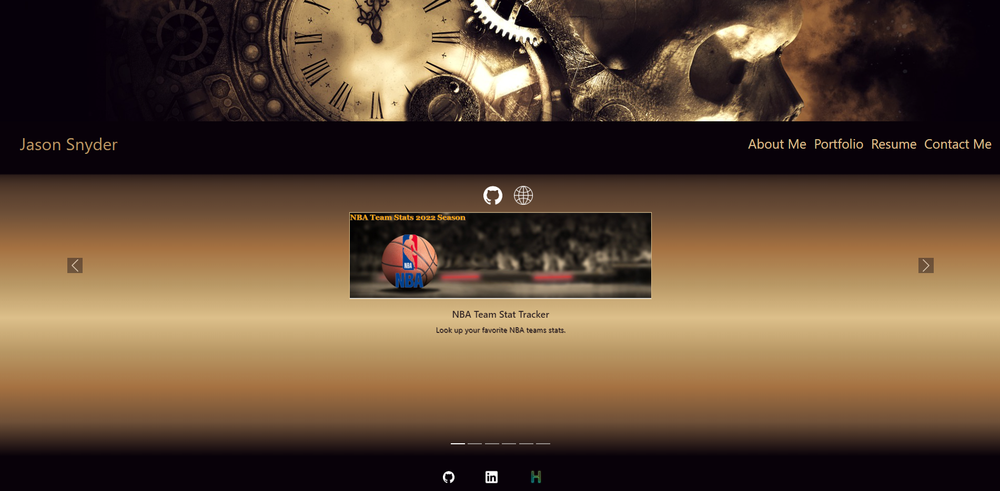
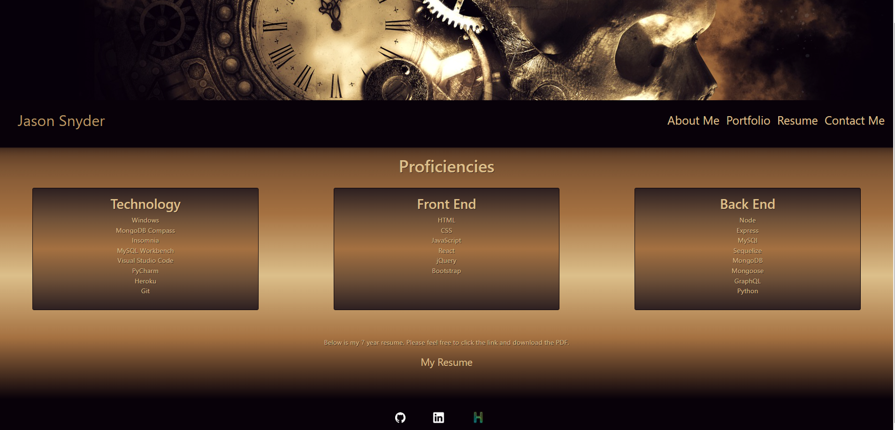
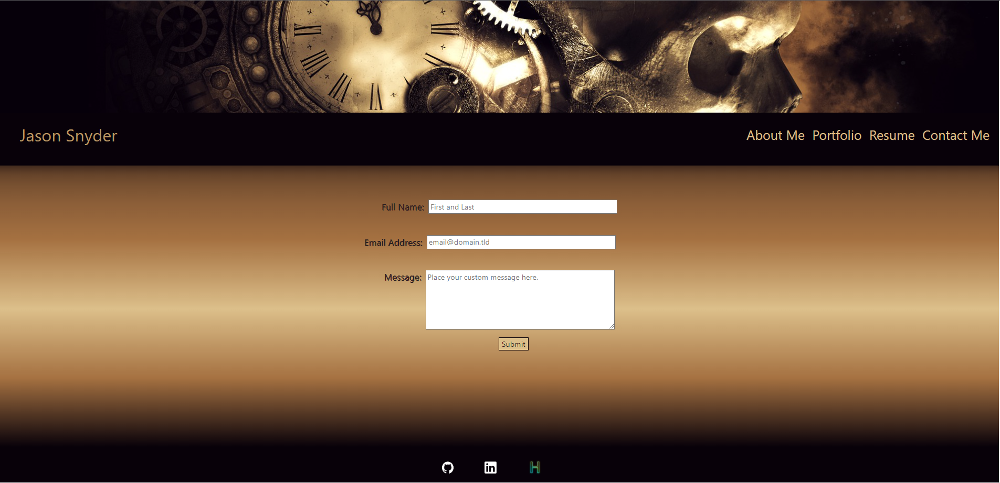

# React Portfolio

  ## Description
  I used Bootstrap and React to make an updated personal portfolio.  I plan on using this portfolio for something to send possible employeers to showcase my work and abilities.
  
  ## Table of Contents

  - [Tools](#tools)
  - [License](#license)
  - [Screenshots](#screenshots)
  - [Questions](#questions)
  
  
  ## Tools
  
 React, Bootstrap, react-router
  
  
  ## License

  
  
  ## Screenshots
  [Live Portfolio](https://jsnyder159.github.io/react-portfolio/)

  ## Questions

  If you have any questions about the project please contact me at.
  - [GitHub](https://github.com/Jsnyder159?tab=repositories)
  - Email: jw.snyder159@gmail.com
